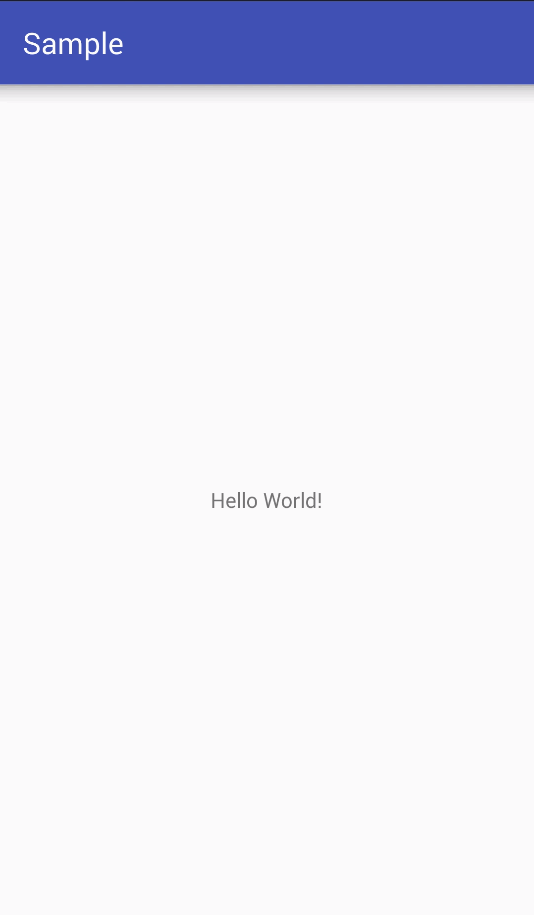

# android-noticeview
A custom notice view for android.

# screen-shot


# features
Starting the horizontal scrolling until to the text end, while the text length is greater than width of view.
<br/>
Starting the vertical scrolling, while delaying a custom duration or horizontal scrolling to to the text end.

# usage
### dependencies:
```
compile 'com.charlie.widget:noticeview:1.0.0'
```
### xml:
```
<com.charlie.widget.NoticeView
    android:layout_width="0dp"
    android:layout_height="match_parent"
    android:layout_weight="1"
    app:textSize="15sp"             //字体大小，默认15sp
    app:textColor="#000000"         //字体颜色，默认#000000
    app:verScrollDuration="500"     //垂直动画时长，默认500毫秒
    app:verScrollDelay="2500"       //延迟多久开始垂直动画，默认2500毫秒
    app:horScrollDelay="1000"       //延迟多久开始水平动画，默认1000毫秒
    app:notices="@array/notices"    //供展示的字符串数组，默认null
    />
```
# License
```
Copyright 2017 Charlie

Licensed under the Apache License, Version 2.0 (the "License");
you may not use this file except in compliance with the License.
You may obtain a copy of the License at

    http://www.apache.org/licenses/LICENSE-2.0

Unless required by applicable law or agreed to in writing, software
distributed under the License is distributed on an "AS IS" BASIS,
WITHOUT WARRANTIES OR CONDITIONS OF ANY KIND, either express or implied.
See the License for the specific language governing permissions and
limitations under the License.
```
